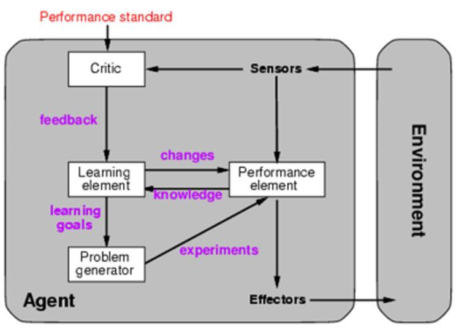
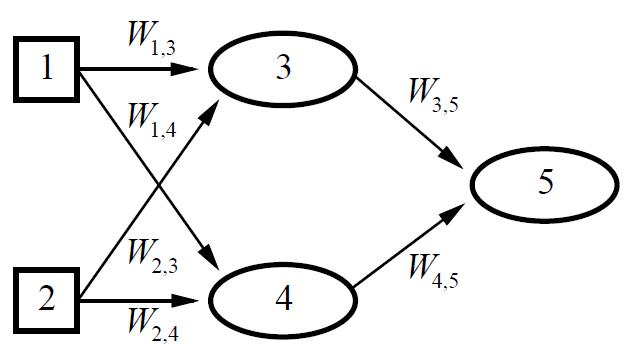

# Homework 4

## 18.19

Construct by hand a neural network that computes the XOR function of two inputs.
Make sure to specify what sort of units you are using.

## 18.23
Suppose that a training set contains only a single example, repeated 100 times. In
80 of the 100 cases, the single output value is 1; in the other 20, it is 0. 

What will a back-propagation network predict for this example, assuming that it has been trained and reaches a global optimum? 

(Hint: to find the global optimum, differentiate the error function and set it to zero.)
## 1 Learning agent

Explain the working mechanism of a learning agent, as shown in the following figure.

## 2 Feed-forward network

A feed-forward network is shown below. The input layer has two inputs $a_1$ , $a_2$ , the hidden layer has two neuros $a_3$ , $a_4$ , and the output is a 5. The activation function for each node is g(.), while the weights has been indicated between the nodes.

(1) Explain what is feed-forward network?

(2) Write the formulation for the output $a_5$.

## 3. Back-propagation.

Explain the idea of back-propagation for neural networks training.

## 4. Convolution Neural Network.

Explain the idea of Convolutional Neural Network and list its three applications. Draw a
diagram to demonstrate a typical CNN architecture.

## 5. Perceptron

Consider a single sigmoid perceptron with bias weight $w_0=1$, a single input $x_1$ with weight
$w_1=-1$ (MINUS ONE), and the sigmoid activation function $g(h)=1/(1+exp(-h))$. For what
input $x_1$ does the perceptron output value $y$(assume $0<y<1$)?

